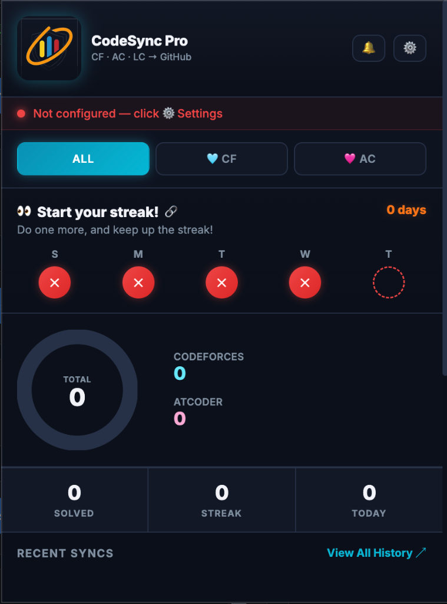
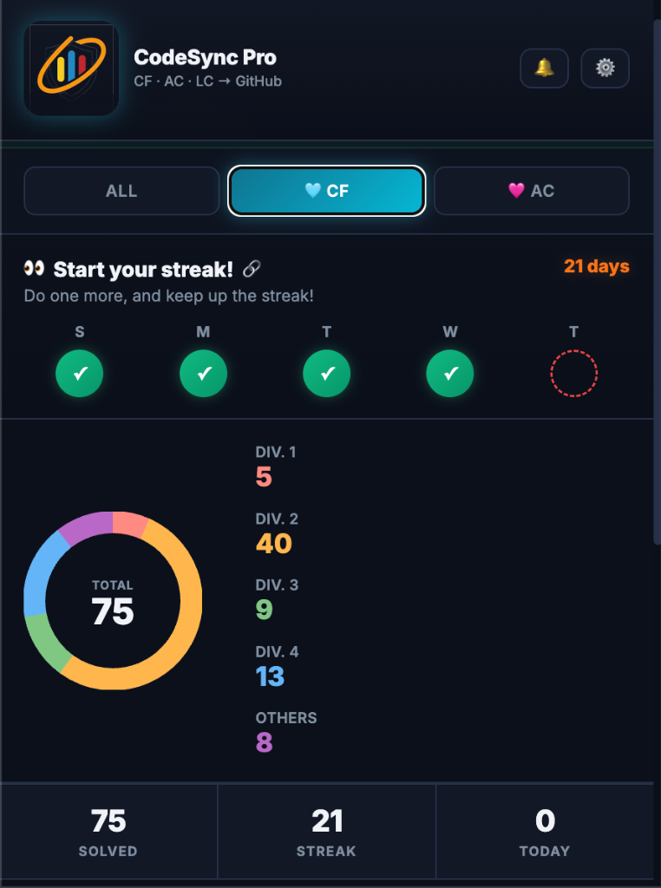
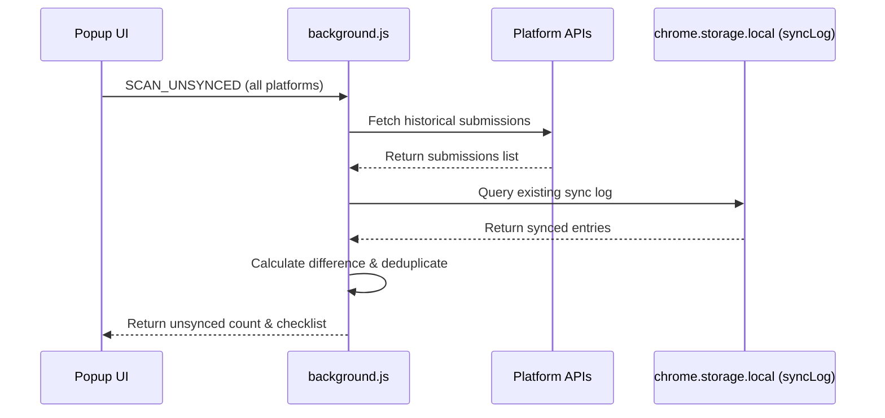

<div align="center">
  <h1>⚡ CodeSync Pro</h1>
  
  <p><b>An enterprise-grade, secure, and fully automated browser extension that synchronizes your competitive programming and algorithmic solutions from Codeforces, AtCoder, and LeetCode directly to a GitHub repository of your choice.</b></p>
  <br>
  
  
</div>

---

## 📖 Table of Contents
1. [🌟 Product Philosophy & Workflow](#-product-philosophy--workflow)
2. [✨ Core Features & Platform Support](#-core-features--platform-support)
3. [📁 Repository Directory Structure Hierarchy](#-repository-directory-structure-hierarchy)
4. [🛠️ Platform Scraping & Hook Specifications](#%EF%B8%8F-platform-scraping--hook-specifications)
   - [Codeforces: background.js Background Polling Loop](#1-codeforces-backgroundjs-background-polling-loop)
   - [AtCoder: Scraper-Tab Proxy & OuterHTML DOM Cache](#2-atcoder-scraper-tab-proxy--outerhtml-dom-cache)
   - [LeetCode: MutationObserver & Monaco Code Extractor](#3-leetcode-mutationobserver--monaco-code-extractor)
5. [🔄 Smart Sync Center: Concurrency & Deduplication](#-smart-sync-center-concurrency--deduplication)
   - [Scanning Workflow Sequence](#scanning-workflow-sequence)
   - [Algorithmic Deduplication Logic](#algorithmic-deduplication-logic)
   - [API Rate Limiting & Safety Throttling](#api-rate-limiting--safety-throttling)
6. [🔐 Security, Obfuscation & Privacy Architecture](#-security-obfuscation--privacy-architecture)
   - [Token Encryption/Obfuscation Sequence](#token-encryptionobfuscation-sequence)
   - [Isolated Offscreen DOM Parsing Sandbox](#isolated-offscreen-dom-parsing-sandbox)
7. [⚙️ Storage Schemas & Database Structure](#%EF%B8%8F-storage-schemas--database-structure)
8. [🩹 Failure Recovery: Retry Queue State Machine](#-failure-recovery-retry-queue-state-machine)
9. [📡 GitHub REST API Integration Specs](#-github-rest-api-integration-specs)
10. [🎨 UI Design System & Interactive Widgets](#-ui-design-system--interactive-widgets)
11. [🔤 Language Extension Mapping Registry](#-language-extension-mapping-registry)
12. [🚀 Installation & Setup Guide](#-installation--setup-guide)
13. [🧑‍💻 Developer Diagnostics & Debugging Guide](#-developer-diagnostics--debugging-guide)
14. [❓ FAQ & Troubleshooting Guide](#-faq--troubleshooting-guide)

---

## 🌟 Product Philosophy & Workflow

When solving competitive programming challenges, backing up your code manually is tedious and breaks your focus. **CodeSync Pro** automates this by acting as a silent background agent. 

### 🔄 Synchronous Integration Lifecycle:
1. **Solve:** Write and submit your code on your preferred platform.
2. **Intercept:** The extension captures the accepted status using passive network/DOM monitoring or background alarms.
3. **Parse:** Scrapes the exact question statement, time limits, memory limits, and sample test cases in an isolated, secure offscreen tab.
4. **Encrypt:** obfuscates access credentials locally using Base64 & character shifting.
5. **Upsert:** Checks the current file on GitHub. If the code is new or faster, it updates the file in place with a clean git SHA commit.
6. **Notify:** Plays a success chime and injects a glassmorphic confirmation badge (`🐙 Synced to GitHub ↗`) directly into the problem webpage.

---

## ✨ Core Features & Platform Support

| Feature | Codeforces (CF) | AtCoder (AC) | LeetCode (LC) |
|---|---|---|---|
| **Sync Type** | Background Alarm Poller | Content Script Hook + Proxy Tab | MutationObserver DOM hook |
| **Parsing Engine** | Offscreen DOMParser / API | Scraper Tab / DOM caching | Content Script DOM Extraction |
| **Folder Division** | Division-based (`Div. 1` - `Div. 4`, `Others`) | Category-based (`Beginner`, `Regular`, etc.) | Difficulty-based (`Easy`, `Medium`, `Hard`) |
| **Cloudflare Bypass** | Native Chrome Cookie Session | Tab Proxy Credentials Relay | Client Tab session piggyback |
| **Problem Statement** | Full markdown with sample I/O | Full markdown with constraints | Description text & test metadata |
| **Badge Injection** | Yes (Bottom Right glassmorphic) | Yes (Bottom Right glassmorphic) | Yes (Bottom Right glassmorphic) |

---

## 📁 Repository Directory Structure Hierarchy

CodeSync Pro maintains a strict folder hierarchy structure:

```text
your-cp-repo/
├── AtCoder/                           ← Top-level platform node
│   ├── Beginner/                      ← Category grouping
│   │   └── ABC 300 - A - Air Cond/    ← Problem folder name
│   │       ├── A - Air Cond.cpp       ← Source code file
│   │       └── README.md              ← Statement markdown file
│   ├── Regular/
│   │   └── ARC 150 - B - Factor/
│   │       ├── B - Factor.py
│   │       └── README.md
│   └── Grand/
│       └── AGC 001 - A - BBQ Easy/
│           ├── A - BBQ Easy.rs
│           └── README.md
├── Codeforces/
│   ├── Div. 1/
│   │   └── 1234F - Substring/
│   │       ├── 1234F - Substring.cpp
│   │       └── README.md
│   ├── Div. 2/
│   │   └── 4A - Watermelon/
│   │       ├── 4A - Watermelon.cpp
│   │       └── README.md
│   └── Others/
│       └── 100001A - Gym Problem/
│           ├── 100001A - Gym Problem.cpp
│           └── README.md
└── LeetCode/
    ├── Easy/
    │   └── Two Sum/
    │       ├── Two Sum.java
    │       └── README.md
    ├── Medium/
    │   └── Add Two Numbers/
    │       ├── Add Two Numbers.py
    │       └── README.md
    └── Hard/
        └── Median of Two/
            ├── Median of Two.cpp
            └── README.md
```

---

## 🛠️ Platform Scraping & Hook Specifications

### 1. Codeforces: background.js Background Polling Loop
Rather than using heavy script injections on every search query, Codeforces uses a lightweight background poller scheduled via the `chrome.alarms` API:
*   **Trigger Interval:** Runs every 1 minute (`chrome.alarms.create('poll', { periodInMinutes: 1 })`).
*   **Execution Logic:**
    1. Fetches the active config parameters (`cfHandle`, `lastSyncedId`).
    2. Queries the Codeforces API: `https://codeforces.com/api/user.status?handle={handle}&from=1&count=20`.
    3. Filters out runs that are NOT marked as `"verdict": "OK"`.
    4. Filters out old runs where `submission.id <= lastSyncedId`.
    5. Deduplicates submission events to ensure each unique problem (`${contestId}${problem.index}`) is processed only once.
    6. Calls `syncCF()` to pull code and statements, then commits them.
    7. Updates `lastSyncedId` to the latest processed submission ID.

### 2. AtCoder: Scraper-Tab Proxy & OuterHTML DOM Cache
AtCoder protects its pages using Cloudflare security checks. CodeSync Pro bypasses this with a two-layer credentials-inclusive proxying system:
*   **Task Page Caching:** When you navigate to a problem task page (e.g. `atcoder.jp/contests/.../tasks/...`), `content_ac.js` automatically captures the fully loaded HTML from the browser tab using:
    ```javascript
    var rawHtml = document.documentElement.outerHTML;
    ```
    It sends a `CACHE_AC_PROBLEM` message to the background worker, which parses the structure and saves it to `acProblemsCache` inside local storage. This eliminates the need for background requests that might trigger Cloudflare challenges.
*   **Scraper-Tab Relay:** When performing background synchronization (such as during a Smart Sync history upload), the service worker sends a `FETCH_URL` message to one of your active AtCoder browser tabs. The content script fetches the page with `{ credentials: 'include' }` inside your active, authenticated browser session and returns the clean HTML page back to the service worker.

### 3. LeetCode: MutationObserver & Monaco Code Extractor
Because LeetCode is a modern Single Page Application (SPA), static DOM scraping fails during dynamic routing. CodeSync Pro solves this using high-frequency mutation observers and custom DOM queries:
*   **State Observer:** A `MutationObserver` watches changes in the DOM tree, checking for a submission result tag:
    ```javascript
    var verdict = document.querySelector('[data-e2e-locator="submission-result"]');
    ```
*   **Monaco Code Extraction:** The script extracts the source code by selecting Monaco Editor lines from the DOM structure:
    ```javascript
    var lines = document.querySelectorAll('.view-lines .view-line');
    var code = Array.from(lines).map(l => l.textContent).join('\n');
    ```
*   **Sync Dispatch:** Dispatches a `SYNC_LC` message payload to the background service worker with submission details (runtime, memory limits, language).

---

## 🔄 Smart Sync Center: Concurrency & Deduplication

### Scanning Workflow Sequence
1. The user clicks **"🔍 Scan Unsynced"** in the popup window.
2. The extension queries public platform endpoints:
   * **Codeforces:** Queries the status API for all accepted runs.
   * **AtCoder:** Fetches the solved submissions list from the Kenkoooo API: `https://kenkoooo.com/atcoder/resources/submissions.json?user={handle}`.
   * **LeetCode:** Fetches historical submissions via LeetCode's public user profile submission query.
3. The results are compared against your local `syncLog`. Unsynced problem IDs are highlighted and counted.



### Algorithmic Deduplication Logic
If you have multiple accepted submissions for the same problem:
1. The Smart Sync engine sorts your submissions by performance:
   * First by execution runtime (ascending).
   * Second by memory usage (ascending).
2. It selects the fastest, most resource-efficient submission (index `0`).
3. Slower runs are ignored, committing only your best code to the repository.

### API Rate Limiting & Safety Throttling
To prevent your account from hitting GitHub's API rate limits or triggering security checks on Codeforces or AtCoder, the Smart Sync Center implements a sequential throttle. Requests are spaced out using a variable delay (800ms - 1500ms). This guarantees a clean sync process while running in the background.

---

## 🔐 Security, Obfuscation & Privacy Architecture

### Token Encryption/Obfuscation Sequence
To prevent local malware or unauthorized extensions from reading your GitHub Personal Access Token (PAT) from `chrome.storage.local`, CodeSync Pro applies a simple obfuscation layer before saving credentials:

```javascript
// Reverse, escape, and encode to Base64
function obfuscate(str) {
  if (!str) return '';
  return btoa(unescape(encodeURIComponent(str.split('').reverse().join(''))));
}

// Decode Base64, unescape, and reverse back
function deobfuscate(str) {
  if (!str) return '';
  try {
    return decodeURIComponent(escape(atob(str))).split('').reverse().join('');
  } catch(e) {
    return str; // Fallback if already plain text
  }
}
```

This transforms your token into a secure Base64 format. The token is decrypted in transient memory only when communicating with GitHub's APIs.

### Isolated Offscreen DOM Parsing Sandbox
Problem parsing can be resource-heavy. CodeSync Pro delegates this work to a background offscreen document (`offscreen.html`), keeping your browser tabs fast and responsive:
*   The service worker sends raw HTML data to the offscreen page.
*   The offscreen page parses the DOM tree, extracts details like description sections and test cases, and formats them into clean Markdown.
*   The formatted data is returned to the service worker to be pushed to GitHub.

---

## ⚙️ Storage Schemas & Database Structure

CodeSync Pro uses Chrome's secure storage area (`chrome.storage.local`) to store configuration settings and sync logs. Below is a detailed schema of the database keys:

### 1. Configuration Database Schema (`syncConfig`)
```json
{
  "ghUsername": "xxxxxxxxxxx",
  "ghRepo": "CP-Solutions",
  "ghToken": "ZXlKaGJHY2lPaUpTVXpJMU5pSj...",
  "cfHandle": "xxxxxxxxxx",
  "acUsername": "xxxxxxxxx",
  "lcAccount": "xxxxxxxxxx",
  "allowedLanguages": ["cpp", "py"],
  "enableSound": true,
  "enableNotifications": true,
  "cfEnabled": true,
  "acEnabled": true,
  "lcEnabled": true
}
```

### 2. Synchronization Log Database Schema (`syncLog` / `pc_` keys)
```json
{
  "CF:4A": {
    "sha": "9b1c7da8d5e8f4c3a2a190b8d7e6f5c4b3a2a190",
    "path": "Codeforces/Div. 2/4A - Watermelon/4A - Watermelon.cpp",
    "subId": "261899120",
    "timestamp": 1781034664736,
    "problemName": "4A - Watermelon"
  },
  "AC:abc300_a": {
    "sha": "fc8a4128f73169b1e9c2f5d720a8d3e21820bc90",
    "path": "AtCoder/Beginner/ABC 300 - A - Air Conditioner/A - Air Conditioner.cpp",
    "subId": "75167979",
    "timestamp": 1781035517477,
    "problemName": "A - Air Conditioner"
  }
}
```

---

## 🩹 Failure Recovery: Retry Queue State Machine

If a commit to GitHub fails (e.g. due to API rate limits, temporary connection loss, or credentials issues), the extension logs the failure in a local queue:

```json
"failedQueue": [
  {
    "platform": "CF",
    "path": "Codeforces/Div. 2/4A - Watermelon/4A - Watermelon.cpp",
    "content": "#include <iostream>\nusing namespace std;\n...",
    "message": "Time: 31ms | Memory: 100KB | Language: cpp",
    "platformId": "CF:4A",
    "subId": "261899120",
    "timestamp": 1781034664736,
    "lastError": "HTTP 503: Service Unavailable"
  }
]
```

### 🔄 Recovery Loop:
1. **Detect:** A commit fails, showing a red retry banner on the popup.
2. **Queue:** The problem is saved to the local `failedQueue`.
3. **Retry:** When you click the retry button, the extension sequentially attempts to upload each queued item.
4. **Clean:** On success, the item is removed from `failedQueue` and added to `syncLog`.

---

## 📡 GitHub REST API Integration Specs

CodeSync Pro uses the GitHub REST API (v3) to manage files in your repository. It communicates using two primary endpoints:

### 1. Get File Metadata
*   **Method:** `GET`
*   **Path:** `/repos/{owner}/{repo}/contents/{path}`
*   **Headers:**
    ```http
    Authorization: Bearer <deobfuscated_pat>
    Accept: application/vnd.github+json
    ```
*   **Response:** Returns the file metadata. If the file exists, the extension extracts its `sha` hash. If it returns a `404 Not Found`, the extension prepares to create a new file.

### 2. Create or Update File (Upsert)
*   **Method:** `PUT`
*   **Path:** `/repos/{owner}/{repo}/contents/{path}`
*   **Headers:**
    ```http
    Authorization: Bearer <deobfuscated_pat>
    Content-Type: application/json
    ```
*   **Request Payload:**
    ```json
    {
      "message": "Commit message detailing runtime/memory statistics",
      "content": "Base64EncodedSourceCodeContent...",
      "sha": "9b1c7da8d5e8f4c3a2a..." 
    }
    ```
    *Note: The `sha` field is required when updating an existing file to prevent conflicts. It is omitted when creating a new file.*

---

## 🎨 UI Design System & Interactive Widgets

The extension popup UI is styled with modern CSS features, including:
*   **Aesthetic Theme:** A dark-mode layout featuring glassmorphism elements, backdrop filters, and subtle blue/indigo gradients.
*   **Activity Streak Animation:** Displays a 7-day commit grid. Days with commits glow green, and hovering over them shows tooltips with your solved stats.
*   **Dynamic Charts:** Uses SVG vectors to build dynamic donut charts showing your solved metrics by platform, difficulty, and divisions.

---

## 🔤 Language Extension Mapping Registry

| Platform Language String | File Extension |
|---|---|
| `C++`, `g++`, `gcc`, `clang++`, `cpp` | `.cpp` |
| `Python`, `pypy`, `python3`, `python2` | `.py` |
| `Java` | `.java` |
| `JavaScript`, `node.js`, `nodejs` | `.js` |
| `TypeScript` | `.ts` |
| `Kotlin` | `.kt` |
| `Rust` | `.rs` |
| `Go`, `golang`, `go1` | `.go` |
| `C#`, `csharp`, `mono` | `.cs` |
| `Pascal` | `.pas` |
| `Haskell` | `.hs` |
| `Ruby` | `.rb` |
| `Scala` | `.scala` |
| `PHP` | `.php` |
| `Swift` | `.swift` |
| `Bash`, `shell`, `sh` | `.sh` |
| `MySQL`, `mssql`, `sql` | `.sql` |
| `R` | `.r` |
| `Racket` | `.rkt` |
| `Erlang` | `.erl` |
| `Elixir` | `.ex` |
| `Dart` | `.dart` |
| `C`, `gcc-c`, `clang-c` | `.c` |

---

## 🚀 Installation & Setup Guide

### Step 1 — Create a GitHub Repository
1. Log in to your [GitHub Account](https://github.com/).
2. Create a new repository (e.g., `CP-Solutions`).
3. Set the repository visibility to **Public** or **Private**.
4. Do **not** check the boxes to add a README, `.gitignore`, or license.

### Step 2 — Generate a Personal Access Token (PAT)
1. Go to: [GitHub Settings → Developer Settings → Personal access tokens → Tokens (classic)](https://github.com/settings/tokens/new?scopes=repo&description=CodeSyncPro)
2. Add a description: `CodeSync Pro`.
3. Set the Expiration to **No expiration**.
4. Check the **`repo`** scope checkbox.
5. Click **Generate token** and copy it to a safe place.

### Step 3 — Install the Extension
1. Download the compiled zip package `CodeSync pro.zip`.
2. Extract the archive into a folder named `CodeSync_Pro`.
3. Open your browser and navigate to:
   * Chrome: `chrome://extensions`
   * Edge: `edge://extensions`
4. Toggle the **Developer Mode** switch in the top-right corner.
5. Click the **Load Unpacked** button (top-left) and select the extracted `CodeSync_Pro` folder.
6. Pin the extension to your toolbar by clicking the puzzle icon (🧩).

### Step 4 — Configure Credentials
1. Click the **CodeSync Pro** icon in your toolbar, then click the **⚙️ Settings** icon in the upper-right corner.
2. Fill in your details:
   * **GitHub Username:** Your exact GitHub username.
   * **Repository Name:** The repository name created in Step 1.
   * **Personal Access Token:** The `ghp_...` token generated in Step 2.
   * **Codeforces Handle:** Your active Codeforces handle.
   * **AtCoder Username:** Your AtCoder account username.
   * **LeetCode Handle:** Your LeetCode handle.
   * **Language Filter:** (Optional) Comma-separated list of file extensions to sync (e.g., `cpp, py`). Leave blank to sync all.
3. Click **Save & Test Connection**. The extension will verify your credentials and automatically initialize your repository if needed.

---

## 🧑‍💻 Developer Diagnostics & Debugging Guide

### How to Inspect the Service Worker
1. Open `chrome://extensions` or `edge://extensions`.
2. Find **CodeSync Pro**.
3. Click the **service worker** link next to "Inspect views". This opens a dedicated DevTools window where you can view log outputs, network requests, and errors.

### Locating LevelDB Storage Files on Disk
Chrome extensions store local databases inside your operating system's user profile folder. You can find these files at the following paths:

*   **macOS:**
    ```text
    /Users/{username}/Library/Application Support/Google/Chrome/Default/Local Extension Settings/{extension_id}
    ```
*   **Windows:**
    ```text
    C:\Users\{username}\AppData\Local\Google\Chrome\User Data\Default\Local Extension Settings\{extension_id}
    ```
*   **Linux:**
    ```text
    /home/{username}/.config/google-chrome/Default/Local Extension Settings/{extension_id}
    ```

---

## ❓ FAQ & Troubleshooting Guide

#### Q: Why are my AtCoder submissions failing to sync?
**A:** AtCoder protects its pages using Cloudflare security checks. Make sure you have atcoder.jp open in an active browser tab so the extension can route its requests through your active session.

#### Q: How do I sync only C++ and Python files?
**A:** Open the extension Settings page and enter `cpp, py` in the **Language Filter** input. The extension will ignore all other file formats.

#### Q: What scopes are required for the GitHub Personal Access Token?
**A:** Only the **`repo`** scope is required. This grants the extension write access to commit files to your repository while keeping your account secure.

#### Q: Does the extension support duplicate solutions?
**A:** No. CodeSync Pro checks your repository before committing. If you submit a new solution for a problem you've already solved, it will overwrite the old file in place only if the new solution is faster or uses less memory, keeping your repository clean.

---

**Created and maintained by:**
*   **GitHub Profile:** [parthopaul69](https://github.com/parthopaul69)

<p align="center">Made for competitive programmers 🚀</p>
