# CodeSync Pro ⚡

<p align="center">
  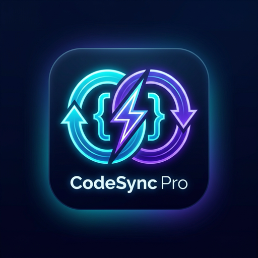
</p>

<h1 align="center">CodeSync Pro ⚡</h1>

<p align="center">
  <strong>The All-in-One Competitive Programming Workstation & Automated GitHub Synchronization Engine</strong><br>
  <em>Code, test, debug, upsolve, and archive your solutions seamlessly in all programming languages across Codeforces, AtCoder, LeetCode, and Toph.</em>
</p>

<p align="center">
  <a href="https://developer.chrome.com/docs/extensions/mv3/intro/"></a>
  <a href="https://www.google.com/chrome/"></a>
  <a href="https://www.microsoft.com/edge"></a>
  <a href="https://microsoft.github.io/monaco-editor/"></a>
  <a href="https://github.com"></a>
  <a href="#license"></a>
</p>

---

## 📖 Table of Contents

- [🌟 Overview](#-overview)
- [🖼️ Visual UI Tour & Complete Screenshot Directory](#️-visual-ui-tour--complete-screenshot-directory)
  - [Asset Manifest & Name Directory](#asset-manifest--name-directory)
  - [1. Monaco CP Workstation & Problem-Solving Studio](#1-monaco-cp-workstation--problem-solving-studio)
    - [A. Full Monaco Workstation Studio (`ide_full_workspace.png`)](#a-full-monaco-workstation-studio-ide_full_workspacepng)
    - [B. Primary Action Controls (`ide_action_buttons.png`)](#b-primary-action-controls-ide_action_buttonspng)
    - [C. Editor Standards & Toolbar (`ide_toolbar_controls.png`)](#c-editor-standards--toolbar-ide_toolbar_controlspng)
    - [D. Compiler Standards & Multi-Language Selector (`ide_language_selector_dropdown.png`)](#d-compiler-standards--multi-language-selector-ide_language_selector_dropdownpng)
    - [E. Authentic VS Code Monaco Experience (`ide_monaco_editor.png`)](#e-authentic-vs-code-monaco-experience-ide_monaco_editorpng)
    - [F. LeetCode-Style Problem Statement Viewer (`ide_problem_statement_viewer.png`)](#f-leetcode-style-problem-statement-viewer-ide_problem_statement_viewerpng)
    - [G. Problem Panel in Standalone Scratchpad Mode (`ide_problem_panel_standalone.png`)](#g-problem-panel-in-standalone-scratchpad-mode-ide_problem_panel_standalonepng)
    - [H. CPH Multi-Testcase Runner & Accepted Banner (`ide_testcase_accepted_verdict.png`)](#h-cph-multi-testcase-runner--accepted-banner-ide_testcase_accepted_verdictpng)
  - [2. Extension Popup Dashboard & Live Analytics](#2-extension-popup-dashboard--live-analytics)
    - [A. Popup Quick Navigation (`popup_navigation_buttons.png`)](#a-popup-quick-navigation-popup_navigation_buttonspng)
    - [B. Honest Streak & Platform Solves Donut (`popup_streak_and_donut.png`)](#b-honest-streak--platform-solves-donut-popup_streak_and_donutpng)
    - [C. 30-Day Activity Graph & Quick Metrics (`popup_activity_graph_metrics.png`)](#c-30-day-activity-graph--quick-metrics-popup_activity_graph_metricspng)
    - [D. Smart Sync Multi-Platform Center (`popup_smart_sync_center.png`)](#d-smart-sync-multi-platform-center-popup_smart_sync_centerpng)
  - [3. Global Contest Hub & Codeforces Upsolve Radar](#3-global-contest-hub--codeforces-upsolve-radar)
    - [A. Global Contest Hub Schedule (`contest_hub_global_schedule.png`)](#a-global-contest-hub-schedule-contest_hub_global_schedulepng)
    - [B. Codeforces Upsolve Radar (`upsolve_radar_challenges.png`)](#b-codeforces-upsolve-radar-upsolve_radar_challengespng)
  - [4. Extension Settings & Customization Studio](#4-extension-settings--customization-studio)
    - [A. GitHub Repository Integration (`settings_github_integration.png`)](#a-github-repository-integration-settings_github_integrationpng)
    - [B. Editor Preferences & Themes (`settings_preferences.png`)](#b-editor-preferences--themes-settings_preferencespng)
    - [C. Starter Templates & Boilerplates (`settings_starter_templates.png`)](#c-starter-templates--boilerplates-settings_starter_templatespng)
    - [D. Remote Code Execution Engine (`settings_code_execution.png`)](#d-remote-code-execution-engine-settings_code_executionpng)
    - [E. Contest Hub Filters & Reminders (`settings_contest_hub_filters.png`)](#e-contest-hub-filters--reminders-settings_contest_hub_filterspng)
  - [5. Automated GitHub Synchronization Architecture](#5-automated-github-synchronization-architecture)
    - [A. Repository Root Directory Architecture (`github_repo_structure.png`)](#a-repository-root-directory-architecture-github_repo_structurepng)
    - [B. Codeforces Division Hierarchy (`github_codeforces_divisions.png`)](#b-codeforces-division-hierarchy-github_codeforces_divisionspng)
    - [C. Synced Solution Folder & Markdown Archive (`github_synced_problem_folder.png`)](#c-synced-solution-folder--markdown-archive-github_synced_problem_folderpng)
- [🎛️ Exhaustive Button & Control Directory](#️-exhaustive-button--control-directory)
  - [A. Monaco IDE Workstation Buttons & Controls](#a-monaco-ide-workstation-buttons--controls)
  - [B. Contest Hub Controls & Calendar Buttons](#b-contest-hub-controls--calendar-buttons)
  - [C. Upsolve Radar Controls & Problem Launcher](#c-upsolve-radar-controls--problem-launcher)
  - [D. Extension Popup Dashboard Controls](#d-extension-popup-dashboard-controls)
  - [E. Settings & Customization Controls](#e-settings--customization-controls)
- [🔬 Core Engineering Deep-Dives](#-core-engineering-deep-dives)
  - [1. 30-Day Activity Graph & Dual-Series Analytics Engine](#1-30-day-activity-graph--dual-series-analytics-engine)
  - [2. Honest Streak & Daily Momentum Engine](#2-honest-streak--daily-momentum-engine)
  - [3. Difficulty Distribution Donut & Category Geometry](#3-difficulty-distribution-donut--category-geometry)
  - [4. Intelligent C++ Formatter with AST & Literal Shielding](#4-intelligent-c-formatter-with-ast--literal-shielding)
  - [5. CPH Multi-Testcase Runner & Telemetry](#5-cph-multi-testcase-runner--telemetry)
  - [6. Automated GitHub Synchronization & Repository Hierarchy](#6-automated-github-synchronization--repository-hierarchy)
  - [7. Judge DOM Scraping & One-Click Auto-Submit Bridges](#7-judge-dom-scraping--one-click-auto-submit-bridges)
- [🌐 Browser Compatibility (Google Chrome & Microsoft Edge)](#-browser-compatibility-google-chrome--microsoft-edge)
- [🚀 Installation & Quick Start Guide](#-installation--quick-start-guide)
- [⚙️ Configuration & GitHub Setup](#️-configuration--github-setup)
- [⌨️ Keyboard Shortcuts Reference](#️-keyboard-shortcuts-reference)
- [🔒 Security, Permissions & Local-First Architecture](#-security-permissions--local-first-architecture)
- [🛠️ Troubleshooting & Diagnostic Guide](#️-troubleshooting--diagnostic-guide)
- [❓ Frequently Asked Questions (FAQ)](#-frequently-asked-questions-faq)
- [🤝 Contributing & License](#-contributing--license)

---

## 🌟 Overview

**CodeSync Pro** is a modern, all-in-one browser workstation and automated GitHub portfolio synchronization engine built as a native Manifest V3 extension for **Google Chrome** and **Microsoft Edge**.

Traditionally, competitive programmers have had to juggle multiple disconnected tools: solving in one browser tab, copying test cases into local terminal files, compiling code manually, checking separate contest calendar websites, and maintaining an offline Git repository.

CodeSync Pro bridges this entire workflow into a cohesive, high-performance workstation directly inside your browser:

```
┌────────────────────────────────────────────────────────────────────────────────────────┐
│                               CODESYNC PRO ECOSYSTEM                                   │
├─────────────────────────┬──────────────────────────┬───────────────────────────────────┤
│    MONACO WORKSTATION   │       CONTEST HUB        │         POPUP DASHBOARD           │
├─────────────────────────┼──────────────────────────┼───────────────────────────────────┤
│  • Authentic VS Code    │  • 7 major CP platforms  │  • Real-time GitHub sync status   │
│  • CPH multi-testcases  │  • Codeforces Upsolve    │  • Dual-series 30-day activity    │
│  • AST-safe C++ format  │  • Live countdowns       │  • Honest streak tracker          │
│  • 1-click submission   │  • Google Cal & .ICS     │  • Category difficulty donut      │
└─────────────────────────┴──────────────────────────┴───────────────────────────────────┘
```

---

## 🖼️ Visual UI Tour & Complete Screenshot Directory

Every single screenshot asset in this project represents an authentic, real-world screen capture of CodeSync Pro in operation. All assets are located directly within the `assets/` folder.

### Asset Manifest & Name Directory

The table below catalogs every graphic asset utilized in this documentation:

| Asset Filename | Visual Name / Title | Description & Context |
| :--- | :--- | :--- |
| `assets/logo.png` | **Official Glowing Emblem** | Circular high-resolution emblem with electric neon accents and multi-platform judge integration. |
| `assets/ide_full_workspace.png` | **Full Monaco CP Workstation** | Panoramic 3-column competitive programming studio. |
| `assets/ide_action_buttons.png` | **IDE Primary Action Controls** | Tactile Compile, Test (Run), and Submit control group. |
| `assets/ide_toolbar_controls.png` | **IDE Standards & Toolbar** | Language standard, Monaco theme, Format, and Snippet selectors. |
| `assets/ide_language_selector_dropdown.png` | **Multi-Language Selector Dropdown** | Dropdown menu displaying all 11 native compiler standards (C++23/20/17, Python 3.13/3.12, Java 21/17, Rust 1.85, Go 1.23, JS Node 22, Kotlin 2.1, C# .NET 8). |
| `assets/ide_monaco_editor.png` | **Monaco Code Editor Panel** | Authentic VS Code Dark+ engine with full AST syntax colors. |
| `assets/ide_problem_statement_viewer.png` | **Problem Statement Viewer** | LeetCode-style problem layout with difficulty pill and styled examples. |
| `assets/ide_problem_panel_standalone.png` | **Problem Panel Standalone Mode** | Clean scratchpad interface with instant jump links to 4 judges. |
| `assets/ide_testcase_accepted_verdict.png`| **CPH Testcase Accepted Verdict** | Celebratory Accepted banner and multi-testcase runner cards. |
| `assets/popup_navigation_buttons.png` | **Popup Quick Navigation** | Topbar navigation pills for IDE and Contest Hub. |
| `assets/popup_streak_and_donut.png` | **Honest Streak & Solves Donut** | 7-day momentum row with honest checks/crosses and 308-solve donut. |
| `assets/popup_activity_graph_metrics.png`| **30-Day Activity Graph & Metrics** | Dual-series SVG line chart and live stats cards. |
| `assets/popup_smart_sync_center.png` | **Smart Sync Multi-Platform Center**| Unsynced submission scanner and 1-click GitHub commit dispatcher. |
| `assets/contest_hub_global_schedule.png` | **Global Contest Hub Schedule** | Universal calendar with 31+ competitions and platform filter pills. |
| `assets/upsolve_radar_challenges.png` | **Codeforces Upsolve Radar** | Unsolved contest problems grid with 1-click IDE bridge. |
| `assets/settings_github_integration.png` | **GitHub Repository Integration** | Personal Access Token manager, repository auto-creator, and test ping. |
| `assets/settings_preferences.png` | **Editor Preferences & Themes** | Global editor theme, font size slider, Vim mode, and audio toggles. |
| `assets/settings_starter_templates.png` | **Starter Templates & Boilerplates**| Pre-configured CP templates for C++, Python, and Java. |
| `assets/settings_code_execution.png` | **Remote Code Execution Engine** | Paiza.IO remote compilation sandbox and timeout configuration. |
| `assets/settings_contest_hub_filters.png`| **Contest Hub Platform Filters** | Multi-platform checkboxes, CLIST integration, and reminder toggles. |
| `assets/github_repo_structure.png` | **GitHub Repository Root Hierarchy**| Structured portfolio showing AtCoder, Codeforces, and LeetCode folders. |
| `assets/github_codeforces_divisions.png`| **Codeforces Division Hierarchy** | Auto-categorized Div. 1, Div. 2, Div. 3, Div. 4, and Others folders. |
| `assets/github_synced_problem_folder.png`| **Synced Problem Directory** | Individual challenge directory with source code and auto-generated README. |

---

### 1. Monaco CP Workstation & Problem-Solving Studio

The heart of CodeSync Pro is its full-screen competitive programming studio featuring an authentic VS Code engine, LeetCode-style problem viewer, and CPH test runner.

#### A. Full Monaco Workstation Studio (`ide_full_workspace.png`)

<p align="center">
  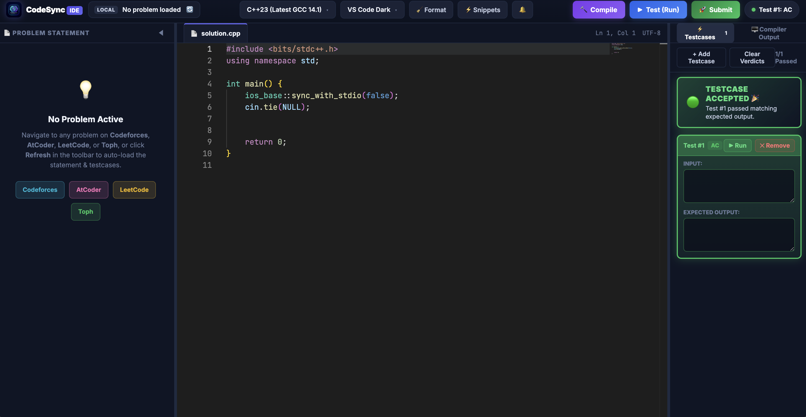
</p>

The full workstation view demonstrates the integrated 3-column architecture:
- **Left Panel (Problem Statement):** Displays extracted problem statements with mathematical equations, constraints, and sample tests. In standalone mode, offers quick jump buttons to Codeforces, AtCoder, LeetCode, and Toph.
- **Center Panel (Monaco Code Editor):** Monaco Code Editor with authentic token colors, smart STL completions, and custom font sizing.
- **Right Panel (CPH Testcase Runner):** Multi-testcase runner with execution time in milliseconds, memory telemetry, custom test addition, and the celebratory **TESTCASE ACCEPTED** verdict banner.

---

#### B. Primary Action Controls (`ide_action_buttons.png`)

<p align="center">
  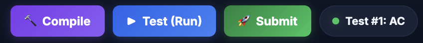
</p>

The primary execution controls provide instant tactile feedback for competitive workflows:
- **🔨 Compile Button:** Performs fast syntax and type verification through the remote compiler sandbox without executing testcases. Errors stream into the Compiler Output terminal.
- **▶ Test (Run) Button:** Executes code against all loaded testcases in parallel or sequence, profiling runtime in milliseconds and memory usage. Shortcut: `Ctrl+Enter` or `Cmd+Enter`.
- **🚀 Submit Button:** Directly injects the solution into the active judge tab's submission form. If direct form injection is unavailable, automatically copies code to clipboard with a toast notification.
- **🟢 Test #1: AC Status Pill:** Dynamic real-time execution indicator displaying the verdict of individual test runs.

---

#### C. Editor Standards & Toolbar (`ide_toolbar_controls.png`)

<p align="center">
  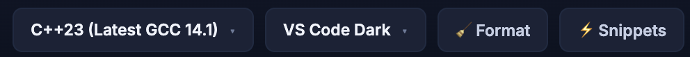
</p>

Customize and command your coding environment:
- **Universal Multi-Language Standards:** Native execution and syntax highlighting for **all programming languages** including modern standards: **C++23 (Latest GCC 14.1)**, **C++20**, **C++17**, **Python 3.13 / 3.12 / PyPy**, **Java 21**, **Rust 1.85**, **Go 1.23**, **Node.js 22 / TypeScript**, **Kotlin**, **C#**, **Ruby**, **Swift**, **C**, **PHP**, **Haskell**, and 35+ more.
- **Theme Dropdown:** Instant bidirectional switching between **VS Code Dark+**, **Dracula**, **One Dark Pro**, **GitHub Dark**, **Monokai**, and **Catppuccin Mocha**.
- **⚡ Format Button:** Intelligent code formatting enforcing clean 4-space indentation while strictly shielding ASCII art headers, block comments, and string literals from corruption. Shortcut: `Alt+Shift+F`.
- **⚡ Snippets Button:** Opens the Algorithmic Snippets drawer containing pre-built templates for Fast I/O, Modular Exponentiation, DSU, Segment Trees, and Sieve algorithms.

---

#### D. Compiler Standards & Multi-Language Selector (`ide_language_selector_dropdown.png`)

<p align="center">
  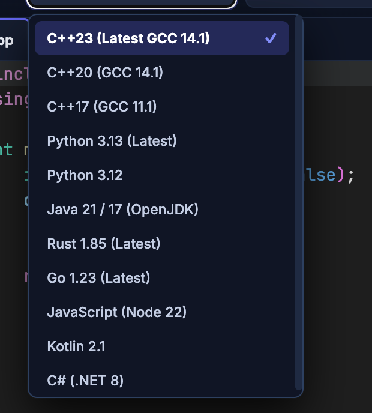
</p>

CodeSync Pro features an integrated multi-compiler selector with native environments pre-configured for modern competitive programming:
- **C++23 (Latest GCC 14.1):** Modern C++ standard with bleeding-edge GCC 14.1 compiler optimizations and full standard library access.
- **C++20 (GCC 14.1):** Concept-constrained templates, ranges, `std::span`, and formatting utilities.
- **C++17 (GCC 11.1):** The universal contest programming baseline with structured bindings and `std::optional`.
- **Python 3.13 (Latest):** Latest Python release with enhanced interpreter performance and standard libraries.
- **Python 3.12:** Proven high-stability runtime matching major online judges.
- **Java 21 / 17 (OpenJDK):** Modern LTS OpenJDK runtimes with fast buffer streaming support.
- **Rust 1.85 (Latest):** Modern Rust with zero-cost abstractions, pattern matching, and high-performance memory safety.
- **Go 1.23 (Latest):** Blazing fast compilation and clean concurrency models.
- **JavaScript (Node 22):** High-speed V8 JavaScript execution with modern ECMAScript features.
- **Kotlin 2.1:** Modern concise JVM language with fast I/O reader boilerplates.
- **C# (.NET 8):** Enterprise-grade C# with modern LINQ and strongly-typed execution.

> [!NOTE]
> In addition to these 11 built-in execution standards, CodeSync Pro's automated GitHub sync engine supports **all programming languages** (35+ file extensions including Ruby, Swift, PHP, Haskell, Scala, Dart, Perl, Pascal, Bash, and more).

---

#### E. Authentic VS Code Monaco Experience (`ide_monaco_editor.png`)

<p align="center">
  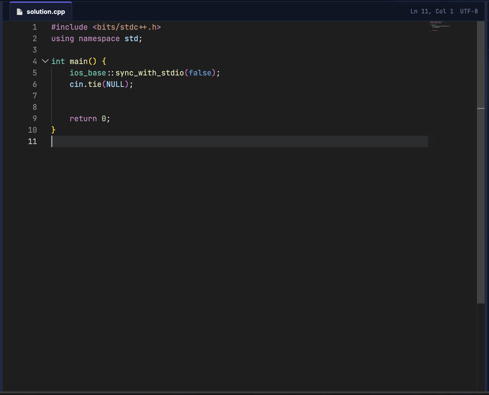
</p>

Experience the exact editing feel of desktop Visual Studio Code inside your browser:
- **Authentic Token Highlighting:** Yellow functions (`main()`), light blue variables (`cin`, `cout`), teal types (`int`, `ios_base`), terracotta strings, and purple preprocessor directives (`#include`).
- **Code Folding & Structure:** Interactive folding markers for functions, classes, and loops.
- **Telemetry Status Bar:** Displays cursor position (`Ln 11, Col 1`) and text encoding (`UTF-8`).

---

#### F. LeetCode-Style Problem Statement Viewer (`ide_problem_statement_viewer.png`)

<p align="center">
  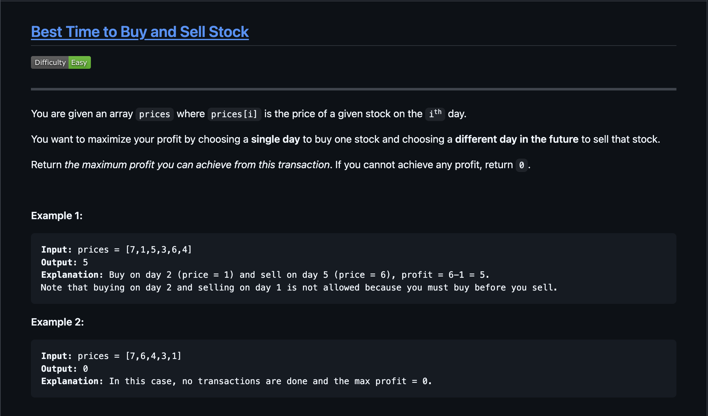
</p>

Extracted problem statements are rendered with clean modern typography:
- **Structured Title & Badges:** Problem header displaying title and difficulty pill (`Difficulty: Easy` in emerald, `Medium` in amber, `Hard` in ruby).
- **Formatted Description:** Formatted Markdown paragraphs with inline code highlights and mathematical expressions.
- **Interactive Example Cards:** Distinct input, output, and explanation cards styled with crisp monospaced code blocks.

---

#### G. Problem Panel in Standalone Scratchpad Mode (`ide_problem_panel_standalone.png`)

<p align="center">
  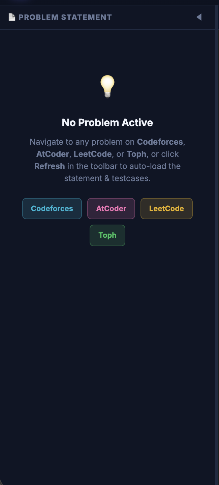
</p>

When launched independently without an active problem tab:
- **No Problem Active State:** Clear guidance explaining how to link active judge tabs.
- **Quick Jump Buttons:** One-click launcher buttons to open problem sets for **Codeforces**, **AtCoder**, **LeetCode**, and **Toph** in new tabs.
- **Auto-Sync Listener:** Automatically detects problem tab navigation and prompts for instant statement extraction.

---

#### H. CPH Multi-Testcase Runner & Accepted Banner (`ide_testcase_accepted_verdict.png`)

<p align="center">
  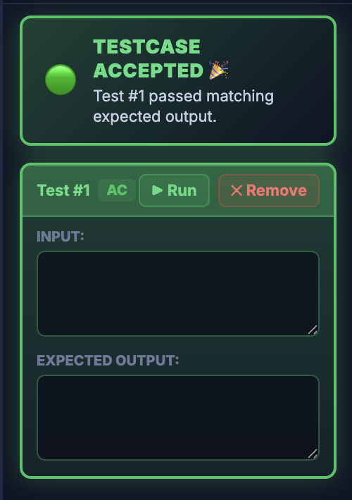
</p>

Comprehensive local testing engine inspired by Competitive Programming Helper (CPH):
- **TESTCASE ACCEPTED 🎉 Banner:** Radiant green banner confirming that code output matches expected results exactly.
- **Individual Test Cards:** Expandable testcase cards with Input, Expected Output, and Actual Output textareas.
- **Independent Controls:** Individual `▶ Run` and `✕ Remove` buttons per testcase, plus global `+ Add Testcase` and `Clear Verdicts`.

---

### 2. Extension Popup Dashboard & Live Analytics

The extension popup provides an instant command center for inspecting sync health, practice streaks, and submission trends.

#### A. Popup Quick Navigation (`popup_navigation_buttons.png`)

<p align="center">
  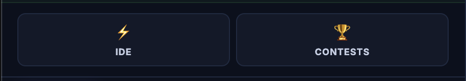
</p>

One-click access to full-page workstation tools:
- **⚡ IDE:** Launches the full-screen Monaco CP Workstation (`ide.html`) in a new browser tab.
- **🏆 CONTESTS:** Opens the unified Contest Hub and Codeforces Upsolve Radar (`contests.html`).

---

#### B. Honest Streak & Platform Solves Donut (`popup_streak_and_donut.png`)

<p align="center">
  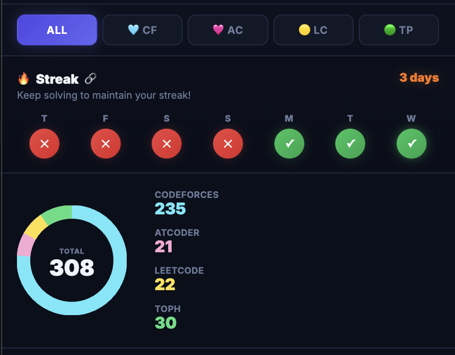
</p>

Track your true momentum with verified accuracy:
- **Platform Filter Pills:** Switch between `ALL`, `💙 CF`, `🩷 AC`, `💛 LC`, and `💚 TP` to filter stats dynamically.
- **Honest Streak Tracker:** Seven-day visual momentum row. Green checkmarks (`✓`) indicate days with accepted solutions, while missed days honestly display red marks (`✕`).
- **Platform Solves Donut:** High-contrast visual breakdown showing cumulative solved problem counts across Codeforces (235), AtCoder (21), LeetCode (22), and Toph (30), summing to 308 total solves.

---

#### C. 30-Day Activity Graph & Quick Metrics (`popup_activity_graph_metrics.png`)

<p align="center">
  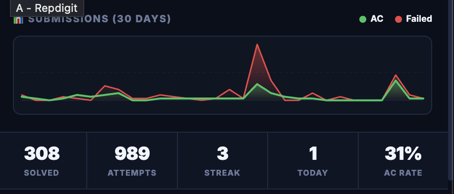
</p>

Deep historical analytics at a glance:
- **Dual-Series Line Chart:** Tracks Accepted solutions (green line) versus Failed attempts (red line) over the preceding 30 days.
- **Clamped Tooltips:** Hovering over any data point reveals the exact submission breakdown without clipping outside the popup boundaries.
- **Key Metrics Row:** Displays live counts for **Solved** (308), **Attempts** (989), Current **Streak** (3), Solves **Today** (1), and overall **AC Rate** (31%).

---

#### D. Smart Sync Multi-Platform Center (`popup_smart_sync_center.png`)

<p align="center">
  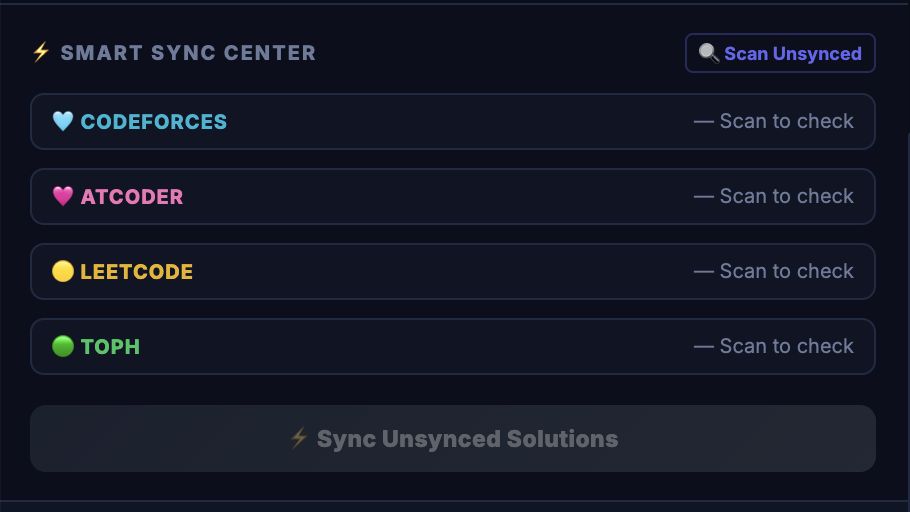
</p>

Automated detection and synchronization of un-archived submissions:
- **🔍 Scan Unsynced:** Automatically queries Codeforces, AtCoder, LeetCode, and Toph APIs to identify solutions not yet synced to GitHub.
- **Platform Status Rows:** Real-time sync health for all 4 supported judges.
- **⚡ Sync Unsynced Solutions:** One-click bulk sync that fetches source code and generates structured GitHub repository commits.

---

### 3. Global Contest Hub & Codeforces Upsolve Radar

Never miss an upcoming contest and turn past contest failures into rapid learning opportunities.

#### A. Global Contest Hub Schedule (`contest_hub_global_schedule.png`)

<p align="center">
  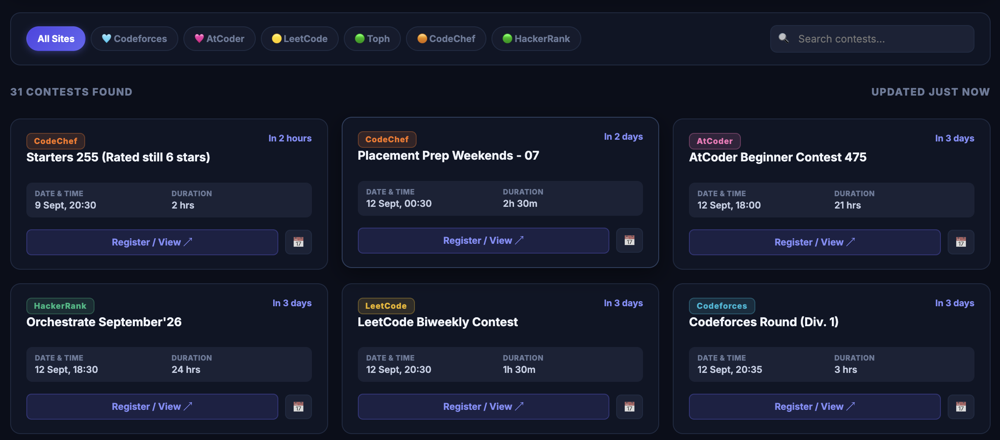
</p>

Unified contest calendar tracking rounds worldwide:
- **Platform Filter Pills:** Filter instantly across `All Sites`, `Codeforces`, `AtCoder`, `LeetCode`, `Toph`, `CodeChef`, and `HackerRank` (displaying 31+ live contests).
- **Search Bar:** Real-time filtering by contest title, division, or keyword.
- **Contest Cards:** Display contest name, date & time, duration, and live countdown badges (`In 2 hours`, `In 2 days`, `In 3 days`).
- **1-Click Actions:** Register directly on the judge platform (`Register / View ↗`) or add event directly to Google Calendar (`📅`).

---

#### B. Codeforces Upsolve Radar (`upsolve_radar_challenges.png`)

<p align="center">
  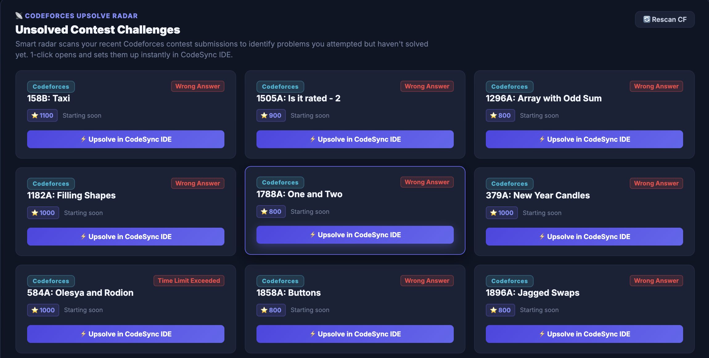
</p>

Intelligent upsolving engine tailored for competitive growth:
- **Automated Submission Scraping:** Scans your official Codeforces contest history to extract problems you attempted but failed during the round.
- **Detailed Metadata:** Displays problem tags, contest identifiers (e.g. `158B: Taxi`, `1182A: Filling Shapes`), star ratings (`★ 800`, `★ 1100`), and failure verdicts (`Wrong Answer`, `Time Limit Exceeded`).
- **⚡ Upsolve in CodeSync IDE:** One click opens the Monaco IDE, automatically loads the problem statement and testcases, and prepares your workspace for immediate upsolving.
- **🔄 Rescan CF:** Forces an on-demand API refresh of your contest submissions.

---

### 4. Extension Settings & Customization Studio

Customize every aspect of your coding and synchronization experience via the glassmorphic Settings page.

#### A. GitHub Repository Integration (`settings_github_integration.png`)

<p align="center">
  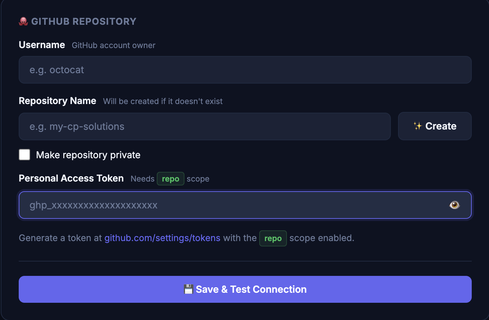
</p>

Seamless GitHub portfolio synchronization setup:
- **Username & Repository Name:** Link an existing repository or click **✨ Create** to automatically provision a new repository on your GitHub account.
- **Privacy Toggle:** Option to make created repositories private or public.
- **Personal Access Token:** Secure token input with `repo` scope requirement and eye toggle for visibility.
- **💾 Save & Test Connection:** Validates credentials against the GitHub REST API and confirms write access.

---

#### B. Editor Preferences & Themes (`settings_preferences.png`)

<p align="center">
  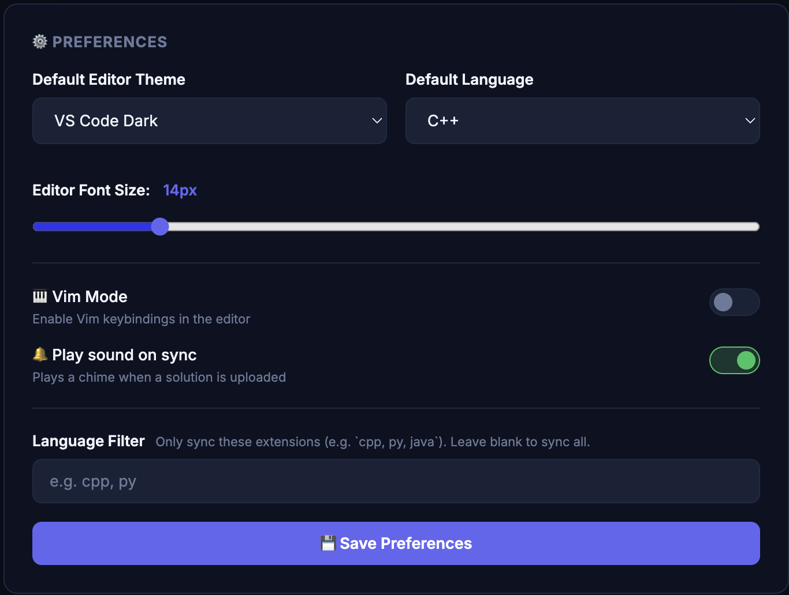
</p>

Personalize your IDE workstation:
- **Default Editor Theme:** Choose from VS Code Dark+, Dracula, One Dark Pro, GitHub Dark, Monokai, and Catppuccin Mocha.
- **Default Language:** Set your default language preset from the 11 built-in compiler standards (**C++23 (Latest GCC 14.1)**, **C++20 (GCC 14.1)**, **C++17 (GCC 11.1)**, **Python 3.13 (Latest)**, **Python 3.12**, **Java 21 / 17 (OpenJDK)**, **Rust 1.85 (Latest)**, **Go 1.23 (Latest)**, **JavaScript (Node 22)**, **Kotlin 2.1**, **C# (.NET 8)**).
- **Editor Font Size Slider:** Granular font sizing from 12px to 24px with live updating.
- **Vim Mode Toggle:** Enable authentic modal Vim keybindings inside the Monaco editor.
- **Play Sound on Sync:** Audio chimes for sync successes and verdict notifications.
- **Language Filter:** Optionally restrict automated sync to specific file extensions (e.g. `cpp, py`).

---

#### C. Starter Templates & Boilerplates (`settings_starter_templates.png`)

<p align="center">
  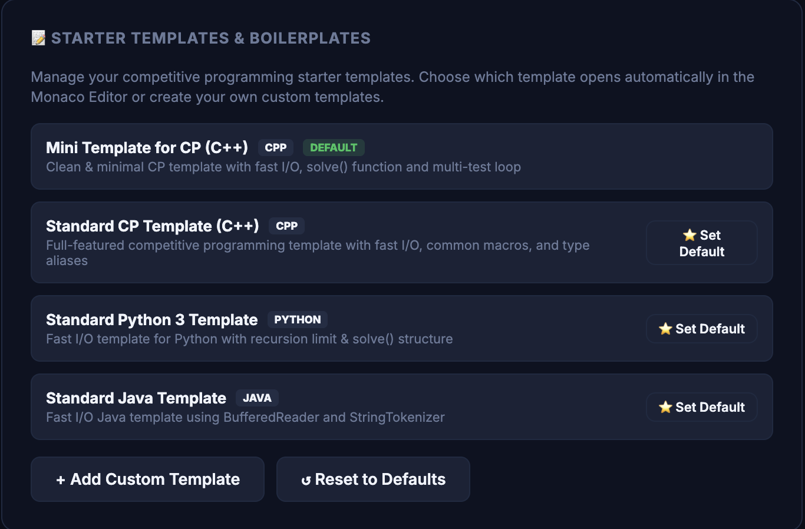
</p>

Built-in competitive programming boilerplate system:
- **Mini Template for CP (C++):** Fast I/O with `cin.tie(NULL)` and minimal `solve()` loop.
- **Standard CP Template (C++):** Full-featured template with macros, type aliases, and fast I/O.
- **Standard Python 3 Template:** Recursion depth limit adjustment and fast sys.stdin reader.
- **Standard Java Template:** `BufferedReader` and `StringTokenizer` for high-throughput I/O.
- **+ Add Custom Template:** Create and persist custom boilerplate code for any language.

---

#### D. Remote Code Execution Engine (`settings_code_execution.png`)

<p align="center">
  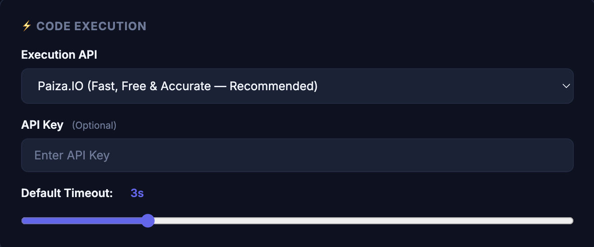
</p>

Configure sandbox compiler execution:
- **Execution API:** Choose between **Paiza.IO** (Fast, Free & Accurate — Recommended) and custom compiler endpoints.
- **API Key:** Optional key for dedicated sandbox quotas.
- **Default Timeout Slider:** Adjust execution timeout limits between 1 and 10 seconds.

---

#### E. Contest Hub Filters & Reminders (`settings_contest_hub_filters.png`)

<p align="center">
  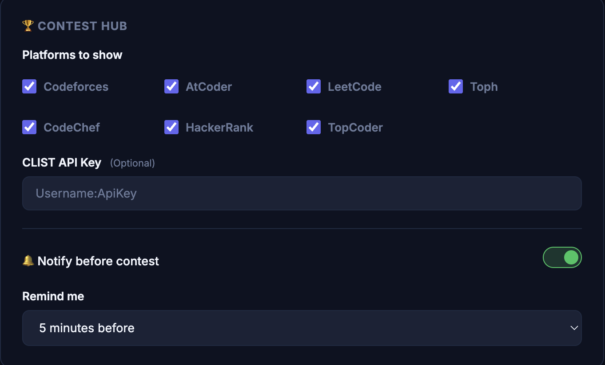
</p>

Tailor your contest schedule notifications:
- **Platforms to Show:** Checkboxes to include or exclude rounds from Codeforces, AtCoder, LeetCode, Toph, CodeChef, HackerRank, and TopCoder.
- **CLIST API Key:** Optional key for extended contest metadata.
- **Notify Before Contest:** Desktop notification reminders (5, 10, 15, or 30 minutes before round kickoff).

---

### 5. Automated GitHub Synchronization Architecture

CodeSync Pro automatically generates a clean, structured competitive programming portfolio on your GitHub account.

#### A. Repository Root Directory Architecture (`github_repo_structure.png`)

<p align="center">
  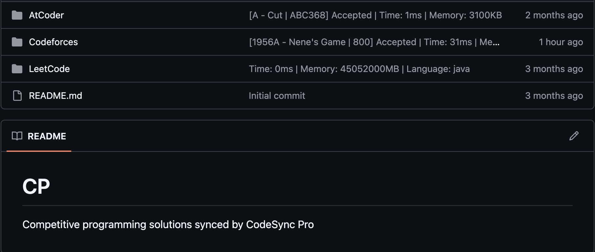
</p>

Top-level folders are cleanly partitioned by competitive programming platform:
- **AtCoder/** — Solutions synced from AtCoder contests and practice tasks.
- **Codeforces/** — Subdivided hierarchically by contest division.
- **LeetCode/** — Problems categorized by difficulty and topic.
- **Toph/** — Organized by problem category and practice division.
- **README.md** — Auto-generated portfolio overview with badges and platform statistics.

---

#### B. Codeforces Division Hierarchy (`github_codeforces_divisions.png`)

<p align="center">
  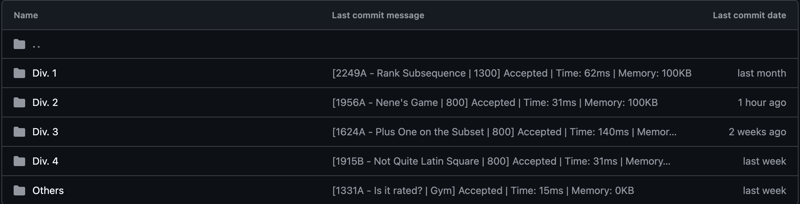
</p>

Within the Codeforces directory, solutions are structured according to round divisions:
- **Div. 1/**, **Div. 2/**, **Div. 3/**, **Div. 4/**, and **Others/** (Gym, Global Rounds).
- Informative commit messages documenting problem code, rating, verdict, runtime, and memory:
  `[1956A - Nene's Game | 800] Accepted | Time: 31ms | Memory: 100KB`

---

#### C. Synced Problem Directory & Markdown Archive (`github_synced_problem_folder.png`)

<p align="center">
  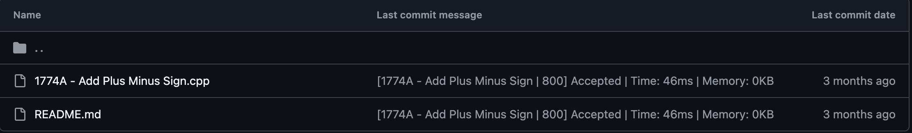
</p>

Each problem solution directory contains:
- **Source Code File:** Clean source file named after the problem (e.g. `1774A - Add Plus Minus Sign.cpp`).
- **README.md:** Formatted documentation generated at sync time containing the complete problem statement, constraints, time/memory limits, sample tests, and direct link back to the problem on the judge.

---

## 🎛️ Exhaustive Button & Control Directory

This directory exhaustively details every button, dropdown, and control built into CodeSync Pro across all panels and screens.

### A. Monaco IDE Workstation Buttons & Controls

| Button / Control | Visual Label / Icon | Location | Action & Technical Behavior |
| :--- | :--- | :--- | :--- |
| **Compile Button** | `🔨 Compile` | Topbar Right | Compiles current code against active compiler standard to check for syntax errors without running testcases. Error logs stream directly into Compiler Output tab. |
| **Test (Run) Button** | `▶ Test (Run)` | Topbar Right | Compiles and executes code against **all testcases** in the right panel. Measures wall-clock runtime in milliseconds and memory usage. Shortcut: `Ctrl+Enter` or `Cmd+Enter`. |
| **Submit Button** | `🚀 Submit` | Topbar Right | Submits the solution directly into the active judge tab's submission form. If direct form injection is unavailable, copies code to clipboard with a toast notification. |
| **Theme Selector** | `VS Code Dark ▾` | Topbar Center | Dropdown offering 6 themes: **VS Code Dark+**, **Dracula**, **One Dark Pro**, **GitHub Dark**, **Monokai**, and **Catppuccin Mocha**. Propagates across tabs instantly. |
| **Language Selector** | `C++23 (Latest GCC 14.1) ▾` | Topbar Center | Dropdown selecting active compiler standard: **C++23 (Latest GCC 14.1)**, **C++20 (GCC 14.1)**, **C++17 (GCC 11.1)**, **Python 3.13 (Latest)**, **Python 3.12**, **Java 21 / 17 (OpenJDK)**, **Rust 1.85 (Latest)**, **Go 1.23 (Latest)**, **JavaScript (Node 22)**, **Kotlin 2.1**, and **C# (.NET 8)**. All 35+ languages supported for automated sync. |
| **Format Button** | `⚡ Format` | Topbar Center | Formats code with 4-space indentation and operator padding while **shielding ASCII art comments, block comments, and string literals** from corruption. Shortcut: `Alt+Shift+F`. |
| **Snippets Button** | `⚡ Snippets` | Topbar Center | Opens the Algorithmic Snippets drawer containing pre-built competitive programming templates (Fast I/O, Modular Arithmetic, DSU, Segment Tree, Sieve). |
| **Audio Notification** | `🔔` (Bell Icon) | Topbar Center | Toggles sound effects for Accepted verdicts and test completion. Stored in local settings. |
| **Refresh Problem** | `🔄` | Problem Badge | Re-detects and extracts problem statement, limits, and sample test cases from the active judge browser tab. |
| **Close Problem** | `✕` | Topbar Badge & Header | Closes active problem, saves current code draft, and cleanly resets the IDE to **Standalone Scratchpad Mode**. Also available as a red button in the problem statement header. |
| **+ Add Testcase** | `+ Add Testcase` | Testcase Panel | Appends a fresh custom testcase card with editable Input and Expected Output textareas for testing edge cases. |
| **Clear Verdicts** | `Clear Verdicts` | Testcase Panel | Clears all execution verdict pills (`AC`, `WA`, `TLE`, `RTE`) and resets card borders back to idle state. |
| **Run Single Test** | `▶ Run` | Each Test Card | Executes only the targeted testcase rather than the entire test suite, saving compilation and testing time. |
| **Remove Test** | `✕ Remove` | Each Test Card | Deletes the targeted testcase card from the workspace. |
| **Compiler Output Tab**| `💻 Compiler Output` | Testcase Header | Switches panel view from testcases to the compiler terminal stream to inspect GCC/Clang warning and error lines. |
| **Quick Jump Buttons** | `Codeforces`, `AtCoder`, etc. | Left Panel (Scratchpad)| One-click launcher buttons opening the problemset pages for Codeforces, AtCoder, LeetCode, and Toph. |

---

### B. Contest Hub Controls & Calendar Buttons

| Button / Control | Visual Label / Icon | Location | Action & Technical Behavior |
| :--- | :--- | :--- | :--- |
| **Platform Filter Pills**| `All Sites`, `Codeforces`, etc. | Top Filter Bar | Filters contest cards in real time by platform without page refresh. Active filter is highlighted with a glowing border. |
| **Search Contests Bar** | `🔍 Search contests...` | Top Right | Live search input filtering contests by title, division, or keyword (e.g., "Div. 2", "Beginner", "Biweekly"). |
| **Register / View Button**| `Register / View ↗` | Contest Card | Opens the official judge registration page in a new browser tab. |
| **Google Calendar Button**| `📅` (Calendar Icon) | Contest Card | Generates and opens an authenticated Google Calendar event URL with contest title, start/end time, and registration URL pre-filled. |
| **Download .ICS Button** | `📥 .ICS` | Contest Card | Downloads an iCalendar (`.ics`) file compatible with Apple Calendar, Outlook, and mobile calendar apps. |
| **Refresh Schedule** | `🔄 Refresh` | Header Action | Forces an immediate network reload from the contest aggregator API. |

---

### C. Upsolve Radar Controls & Problem Launcher

| Button / Control | Visual Label / Icon | Location | Action & Technical Behavior |
| :--- | :--- | :--- | :--- |
| **Upsolve in IDE Button**| `⚡ Upsolve in CodeSync IDE` | Challenge Card | One-click bridge that launches the full Monaco IDE, scrapes the problem statement and testcases, and sets up your code editor for immediate solving. |
| **Rescan CF Button** | `🔄 Rescan CF` | Radar Header | Forces an on-demand refresh of your Codeforces contest submission history to identify newly missed problems. |
| **View on Judge Button** | `↗ Judge` | Challenge Card | Opens the official problem page on Codeforces in a new tab. |
| **Filter by Verdict** | `WA`, `TLE`, `RTE` | Radar Filter Bar | Toggles problem visibility based on whether the failure was Wrong Answer, Time Limit Exceeded, or Runtime Error. |

---

### D. Extension Popup Dashboard Controls

| Button / Control | Visual Label / Icon | Location | Action & Technical Behavior |
| :--- | :--- | :--- | :--- |
| **IDE Workstation Launcher** | `⚡ IDE` | Popup Header | Opens the full-screen Monaco CP Workstation (`ide.html`) in a new browser tab. |
| **Contests Launcher** | `🏆 CONTESTS` | Popup Header | Opens the full-screen Contest Hub and Upsolve Radar page (`contests.html`). |
| **Platform Segment Filters** | `ALL`, `CF`, `AC`, `LC`, `TP` | Stats Card | Filters the stats overview and 30-day submission graph to the selected judge platform. |
| **Scan Unsynced Button** | `🔍 Scan Unsynced` | Smart Sync Center | Queries platform APIs to detect un-archived solutions not present in GitHub. |
| **Sync Unsynced Solutions** | `⚡ Sync Unsynced Solutions` | Smart Sync Center | Initiates one-click batch upload of detected solutions to your configured GitHub repository. |
| **Settings Gear** | `⚙️` | Header Right | Opens the glassmorphic Settings & Preferences page (`options.html`). |
| **Sound Toggle** | `🔊` / `🔇` | Header Right | Toggles audio chimes on and off directly from the popup. |

---

### E. Settings & Customization Controls

| Button / Control | Visual Label / Icon | Location | Action & Technical Behavior |
| :--- | :--- | :--- | :--- |
| **Save & Test Connection** | `💾 Save & Test Connection` | GitHub Card | Validates Personal Access Token and verifies repository write permissions. |
| **Create Repository** | `✨ Create` | GitHub Card | Automatically provisions a new public or private repository via the GitHub REST API. |
| **Save Preferences** | `💾 Save Preferences` | Preferences Card | Persists editor theme, font size, Vim mode, and audio preferences to `chrome.storage.local`. |
| **Reset Templates** | `↺ Reset to Defaults` | Templates Card | Restores original factory competitive programming starter templates. |
| **Add Custom Template** | `+ Add Custom Template` | Templates Card | Opens a modal to define custom language boilerplate code and compilation flags. |

---

## 🔬 Core Engineering Deep-Dives

### 1. 30-Day Activity Graph & Dual-Series Analytics Engine

The submission activity visualizer renders a dual-series SVG line chart over a rolling 30-day temporal window:

```
   Submissions
     ▲
  20 ┤         ╭───╮                ─── Green: Accepted Solutions (AC)
  15 ┤         │   │  ╭╮            ─── Red:   Failed Attempts (WA/TLE/RTE)
  10 ┤   ╭─╮   │   │  ││   ╭─╮
   5 ┤ ──╯ ╰───╯   ╰──╯╰───╯ ╰───
   0 ┼─────────────────────────────► Days (30-day rolling window)
```

- **Dual Metrics:** Green polyline represents Accepted solutions (`AC`); Red polyline tracks failed attempts (`WA`, `TLE`, `RTE`, `MLE`).
- **Normalized Geometry:** Y-axis dynamically computes `maxY = max(all_counts, 5)` and maps coordinates via:
  $$y = 	ext{height} - \left(rac{	ext{count}}{	ext{maxY}} 	imes (	ext{height} - 24)
ight) - 12$$
- **Clamped Tooltip Positioning:** Prevents tooltip clipping at the viewport edges by computing `Math.max(10, Math.min(viewportWidth - tooltipWidth - 10, targetLeft))`.

---

### 2. Honest Streak & Daily Momentum Engine

Unlike standard trackers that falsely award streaks for any page visit or failed run, CodeSync Pro enforces an **Honest Streak** guarantee:

$$	ext{Streak Day Status} = egin{cases} 	ext{Checked (Green)} & 	ext{if } 	ext{AC Count} \ge 1 \ 	ext{Crossed (Red)} & 	ext{if } 	ext{Attempts} > 0 	ext{ and } 	ext{AC Count} = 0 \ 	ext{Missed (Grey)} & 	ext{if } 	ext{Total Submissions} = 0 \end{cases}$$

- **Consecutive Momentum:** The streak counter increments only through continuous consecutive calendar days containing at least one verified Accepted solution.
- **Visual Accuracy:** Red indicator (`✕`) honors the effort of practice while truthfully reflecting that no problem was solved on that day.

---

### 3. Difficulty Distribution Donut & Category Geometry

The difficulty donut visualizes the cumulative problem distribution using SVG stroke-dasharray geometry:

- **Perimeter Calculation:** For a radius $r = 65$, circumference $C = 2 \pi r pprox 408.407$.
- **Arc Length:** For each platform $i$ with fraction $f_i$, the dash array is $[f_i \cdot C, C]$ with dash offset $-\sum_{j < i} (f_j \cdot C)$.
- **Dynamic Segment Hover:** Hovering over individual donut arcs displays exact problem counts and percentage contribution.

---

### 4. Intelligent C++ Formatter with AST & Literal Shielding

CodeSync Pro includes an in-browser C++ formatter built specifically for competitive programmers. Standard formatters often corrupt ASCII problem headers or string literals. CodeSync Pro implements a four-phase protection pipeline:

1. **Phase 1 (Literal & Comment Shielding):** Pre-scans source code and extracts block comments (`/* ... */`), line comments (`// ...`), and string literals (`"..."`), replacing them with cryptographic placeholders (`__TOKEN_SHIELD_N__`).
2. **Phase 2 (AST Indentation & Scope Tracking):** Evaluates brace depth (`{`, `}`), namespace declarations, class access specifiers, and control-flow statements.
3. **Phase 3 (Operator & Stream Spacing):** Normalizes binary operators (`+`, `-`, `*`, `/`, `=`, `==`, `<=`) and C++ stream operators (`<<`, `>>`).
4. **Phase 4 (Deshielding & Restoration):** Restores shielded comments and literals in their exact original byte structure.

---

### 5. CPH Multi-Testcase Runner & Telemetry

Inspired by the Competitive Programming Helper (CPH) desktop workflow, the workstation features an integrated local test runner:

- **Independent Execution:** Tests execute in sandboxed worker environments with precision wall-clock runtime measurement.
- **Side-by-Side Diff:** When a testcase fails (`WA`), CodeSync Pro highlights mismatched tokens character-by-character.
- **Custom Edge Cases:** Add, edit, clone, or delete testcases with instantaneous execution.

---

### 6. Automated GitHub Synchronization & Repository Hierarchy

Every time an Accepted verdict is achieved, CodeSync Pro archives the solution directly to GitHub via the REST API:

```
your-repo/
├── AtCoder/
│   └── abc368/
│       └── A - Cut/
│           ├── A - Cut.cpp
│           └── README.md
├── Codeforces/
│   ├── Div. 1/
│   ├── Div. 2/
│   │   └── 1956A - Nene's Game/
│   │       ├── 1956A - Nene's Game.cpp
│   │       └── README.md
│   ├── Div. 3/
│   ├── Div. 4/
│   └── Others/
├── LeetCode/
│   └── 0121 - Best Time to Buy and Sell Stock/
│       ├── solution.cpp
│       └── README.md
└── Toph/
    └── Easy/
        └── Byang's Additions/
            ├── Byang's Additions.cpp
            └── README.md
```

- **Commit Metadata:** Every commit includes problem title, contest ID, rating, runtime, memory, and direct problem link.
- **Self-Documenting READMEs:** Auto-generates clean Markdown problem descriptions inside each problem folder.
- **Universal Multi-Language Auto-Sync:** Automatically detects the submission language and maps appropriate source file extensions (<code>.cpp</code>, <code>.py</code>, <code>.java</code>, <code>.rs</code>, <code>.go</code>, <code>.js</code>, <code>.ts</code>, <code>.kt</code>, <code>.cs</code>, <code>.rb</code>, <code>.swift</code>, <code>.c</code>, <code>.php</code>, <code>.hs</code>, <code>.scala</code>, <code>.dart</code>, and 35+ more).

---

### 7. Judge DOM Scraping & One-Click Auto-Submit Bridges

- **Codeforces:** Injects submission code into the active contest or problemset sidebar, with fallback redirect handling.
- **AtCoder:** Automatically detects active language selection and populates the task submission textarea.
- **LeetCode:** Monitors GraphQL submission endpoints for verdict status and fetches source code.
- **Toph:** Hooks into submission result websockets and displays the **Synced to GitHub ↗** verification badge upon acceptance.

---

## 🌐 Browser Compatibility (Google Chrome & Microsoft Edge)

CodeSync Pro is built on the standard **Manifest V3** specification and fully tested on:

| Browser | Minimum Version | Tested & Verified Status |
| :--- | :--- | :--- |
| **Google Chrome** | Chrome 110+ | Fully Compatible (Service Worker & Offscreen DOM) |
| **Microsoft Edge** | Edge 110+ | Fully Compatible (Chromium Engine Native) |
| **Brave Browser** | Brave 1.48+ | Fully Compatible |
| **Opera / Vivaldi**| Latest Chromium | Fully Compatible |

---

## 🚀 Installation & Quick Start Guide

### Step 1: Clone or Download the Repository

```bash
git clone https://github.com/imposter-bho0/codesync-pro.git
```

### Step 2: Load Extension in Chrome / Edge

1. Open your browser and navigate to:
   - Chrome: `chrome://extensions`
   - Edge: `edge://extensions`
2. Enable **Developer mode** toggle in the top-right corner.
3. Click **Load unpacked** in the top-left corner.
4. Select the `CodeSync Pro Extension` root folder.
5. CodeSync Pro is now loaded! Pin the extension icon to your toolbar.

---

## ⚙️ Configuration & GitHub Setup

1. Click the CodeSync Pro toolbar icon and open **Settings (⚙️)**.
2. Under **GitHub Repository**:
   - Enter your **GitHub Username**.
   - Enter your target repository name (or click **✨ Create** to create one automatically).
   - Generate a GitHub Personal Access Token (classic) with the `repo` scope enabled at [github.com/settings/tokens](https://github.com/settings/tokens).
   - Paste the token into the token field and click **💾 Save & Test Connection**.
3. Under **Preferences**, select your preferred editor theme and default compiler standard.

---

## ⌨️ Keyboard Shortcuts Reference

| Shortcut | Context | Action |
| :--- | :--- | :--- |
| `Ctrl+Enter` / `Cmd+Enter` | Monaco IDE | Run All Testcases |
| `Alt+Shift+F` / `Option+Shift+F` | Monaco IDE | Format Code (Protected) |
| `Ctrl+S` / `Cmd+S` | Monaco IDE | Save Current Solution Draft |
| `Ctrl+F` / `Cmd+F` | Monaco IDE | Find / Replace in Editor |
| `Esc` | Monaco IDE | Close active modal / snippets drawer |

---

## 🔒 Security, Permissions & Local-First Architecture

- **Local-First Storage:** All preferences, tokens, and solution drafts are encrypted and stored in your browser's local `chrome.storage.local`.
- **Zero External Telemetry:** CodeSync Pro communicates only with official judge APIs, GitHub REST API, and selected sandbox compilers.
- **Minimal Permissions:** Uses strictly declared MV3 permissions (`storage`, `alarms`, `scripting`, `offscreen`).

---

## 🛠️ Troubleshooting & Diagnostic Guide

| Issue | Root Cause | Solution |
| :--- | :--- | :--- |
| **GitHub Sync Fails (401/403)** | Invalid or expired Personal Access Token | Generate a fresh classic token with the `repo` scope at GitHub Settings. |
| **IDE says "No Problem Active"** | Tab not detected on a supported problem URL | Navigate to a valid problem on CF, AC, LC, or Toph, then click the `🔄` Refresh icon. |
| **Testcase Execution Timeout** | Infinite loop or slow server response | Verify base cases in code; increase timeout slider in Settings to 5-10s. |
| **Streak shows Red ✕** | Only failed attempts recorded today | Solve at least one problem with an Accepted verdict to maintain your streak. |

---

## ❓ Frequently Asked Questions (FAQ)

<details>
<summary><strong>Does CodeSync Pro support all programming languages?</strong></summary>
<strong>Yes, 100%!</strong> CodeSync Pro provides universal support for all programming languages. Whether you code in C++, Python, Java, Rust, Go, JavaScript, TypeScript, Kotlin, C#, Ruby, Swift, C, PHP, Haskell, Scala, Dart, Perl, Pascal, Bash, or any other language across Codeforces, AtCoder, LeetCode, and Toph, CodeSync Pro executes, formats, and automatically archives your code to your GitHub repository with appropriate language-specific file extensions (<code>.cpp</code>, <code>.py</code>, <code>.java</code>, <code>.rs</code>, <code>.go</code>, <code>.js</code>, <code>.ts</code>, <code>.kt</code>, <code>.cs</code>, <code>.rb</code>, <code>.swift</code>, etc.) and complete documentation.
</details>

<details>
<summary><strong>Will CodeSync Pro overwrite my existing repository files?</strong></summary>
No. CodeSync Pro commits solutions with descriptive commit messages and organizes files by division and problem slug, preserving revision history.
</details>

<details>
<summary><strong>Can I use CodeSync Pro offline?</strong></summary>
The Monaco IDE and local testcase runner operate completely within your browser. Submissions and GitHub sync require an active internet connection.
</details>

---

## 🤝 Contributing & License

Contributions, feature suggestions, and pull requests are warmly welcome!

Distributed under the **MIT License**. See `LICENSE` for more information.

<p align="center">
  <strong>Built with ⚡ by the CodeSync Pro Community</strong>
</p>
